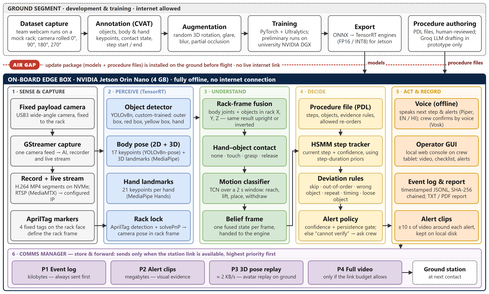
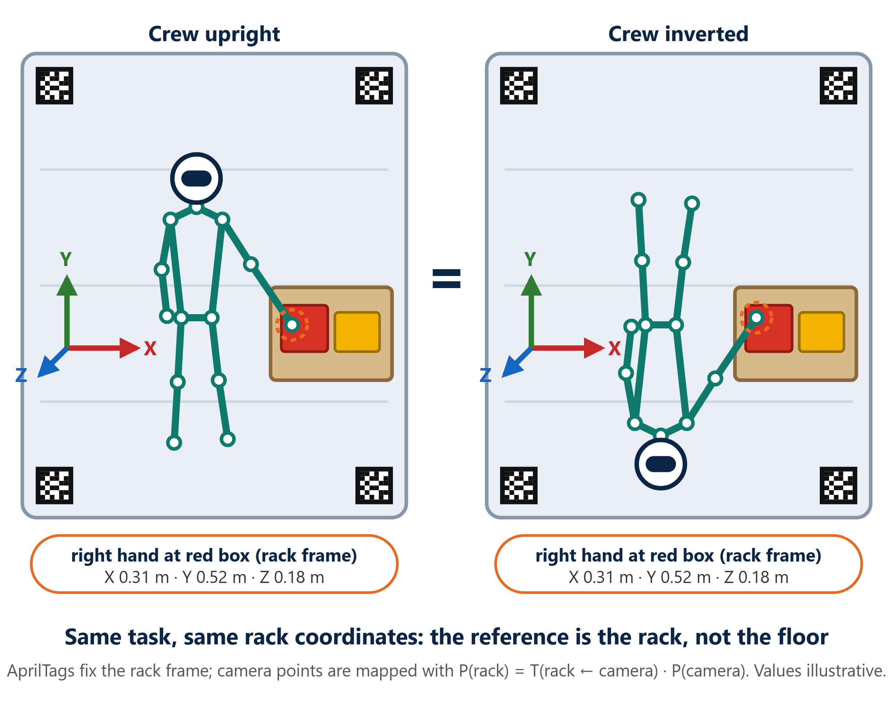

# PARIKSHAK — offline AI witness for on-board experiments

**Smart India Hackathon 2026 · SIH26174 · AI Human Activity Recognition for On-board BAS Experiments**
Indian Space Research Organisation (ISRO), Department of Space · Theme: Space Technology · Category: Software
Team **UnfilteredEngineers** (Team ID 142488)

PARIKSHAK ("examiner") is an AI edge box that sits at a space-station payload rack.
One fixed camera watches the experiment. PARIKSHAK recognises the objects, the
astronaut's body and hands, and measures everything **relative to the rack, not
the floor**. It checks every step against the experiment's procedure file and
speaks the next step. It raises a **voice alert** the moment a step is skipped or
done out of order. When it cannot see, it says *"cannot verify"* and asks the
crew to confirm instead of guessing. Every run writes a small, tamper-evident log.

**Live prototype:** <https://pari-production.up.railway.app/console> (hosted demo; see
[prototype vs flight build](#runs-fully-offline-prototype-vs-flight-build))


*Editable source: [docs/architecture/PARIKSHAK_architecture.drawio](docs/architecture/PARIKSHAK_architecture.drawio)
(open in app.diagrams.net).*

---

## The problem

On the Bharatiya Antariksh Station (BAS), the crew run multi-step experiments with
only intermittent ground contact and a limited downlink. Nobody on the ground can
watch every step live. On lunar missions, communication delay makes real-time
support impossible. A missed or out-of-order step can waste a sample. And
standard 2D pose models, trained on Earth, assume a floor and a fixed "up". They
fail when an astronaut floats sideways or upside-down.

## How PARIKSHAK meets the problem statement

| Requirement in SIH26174 | How PARIKSHAK meets it |
|---|---|
| Track the experiment sequence from local video | Object, body and hand models feed a step tracker (HSMM) on the edge box |
| Suggest the next step | Spoken prompt at the start and after every verified step |
| Voice alert on a skipped / out-of-sequence step | Alert names the step and the reason; "cannot verify" when the view is blocked |
| Timestamped, structured, lightweight text file | Append-only JSONL, one line per event, SHA-256 hash-chained; TXT / PDF report |
| Stream video to a specific IP, store locally | GStreamer pipeline: local segments + RTSP / SRT stream to a configured address |
| GUI for monitoring | Web console: live video, step checklist, alerts, flight log |
| Trained model on an offline standalone system | Detection + pose models on the edge box; target: TensorRT on Jetson Orin Nano 4 GB |

## Orientation-agnostic 3D tracking ("rack as gravity")



- **Rack frame.** AprilTag tag36h11 markers are fixed on the rack face. The tags
  give the camera's pose relative to the rack (`parikshak/zerog/rack.py`):
  +X across the rack, +Y up the rack face, +Z out toward the crew. One tag is
  enough; with no tag visible, the pose is held briefly and then reported LOST.
  It is never invented.
- **3D body.** MediaPipe BlazePose GHUM gives 33 metric 3D landmarks. A PnP
  solve places them in the camera frame, and the rack transform carries them
  into rack coordinates (`parikshak/zerog/pose3d.py`).
- **Any orientation.** If the camera is rolled, the frame is rotated by quarter
  turns before detection. The rack's measured axis picks the turn, and the
  landmarks are mapped back exactly (`parikshak/zerog/orient.py`).
- **Result.** An upright and an inverted crew member touching the same box give
  the same rack coordinates: `P(rack) = T(rack ← camera) · P(camera)`.

Many 3D human-motion methods estimate body orientation against gravity or the
ground plane. In orbit there is no "down". PARIKSHAK uses the rack instead.

## Runs fully offline: prototype vs flight build

| | Hosted prototype (today) | Flight build (on-board box) |
|---|---|---|
| Where it runs | Railway (FastAPI, Docker) + Vercel (static console) | NVIDIA Jetson Orin Nano 4 GB at the rack, headless |
| Perception | MediaPipe + YOLO on ONNX Runtime + AprilTag, CPU | Same models as TensorRT FP16 / INT8 engines |
| Copilot text / speech | Groq API (reasoning, Whisper push-to-talk), local rules as fallback | No LLM on board. Guidance text comes from the procedure file. Piper TTS + Vosk speech recognition, offline |
| Network | Internet | No internet. A firewall blocks outbound traffic; only the station LAN (crew tablet, stream viewer) |
| Updates | git push | Verified update package (models + procedure files) installed on the ground before flight |

The on-board engine package (`parikshak/engine`, `parikshak/pdl`, `parikshak/belief`, …)
cannot open a network socket. This is enforced by `tests/test_offline.py`. The Groq
client lives in `backend/app/groq/`. It is used only by prototype features: the
copilot and drafting experiments from text. Both fall back to local rules without it.

## Experiments

Experiments are files, not code. Each defines its steps, objects, evidence rules
and allowed re-orders. A new experiment whose objects the model already knows
needs only a new file.

| ID | Experiment | File |
|---|---|---|
| WBP-1 | Crew hydration protocol (water bottle) | `configs/experiments/01_wbp1_water_bottle.yaml` |
| BCX-1 | Two-box experiment in a container (red & yellow), based on the ISRO sample set-up | `configs/experiments/02_bcx1_box_collision.yaml` |
| MOA-1 | Multi-object crew workstation sequence | `configs/experiments/03_moa1_multi_object.yaml` |
| CRX-2 | Colloid resuspension and tray return | `configs/experiments/04_crx2_colloid.yaml` |
| SPR-1 | Sprouting salad seeds check | `configs/experiments/05_spr1_sprouting_seeds.yaml` |
| MYO-1 | Myogenesis muscle-loading countermeasure | `configs/experiments/06_myo1_myogenesis.yaml` |
| HCI-1 | Voyager displays screen interaction | `configs/experiments/07_hci1_voyager_displays.yaml` |
| CYA-1 | Cyanobacteria culture photobioreactor check | `configs/experiments/08_cya1_cyanobacteria.yaml` |
| FLT-1 | Microgravity fluid transfer | `configs/experiments/09_flt1_fluid_transfer.yaml` |
| NBP-1 | Neutral body posture and rack reach | `configs/experiments/10_nbp1_body_posture.yaml` |

The procedure-engine test procedures CSP-1 and CRX-2 (PDL format) are in `procedures/`.

You can also draft a new experiment from a text description or a demonstration
video (`parikshak/zerog/autogen.py`). The video path segments the demonstration
into steps and keeps the labelled frames as a starting dataset.

## Dataset, training and self-learning

- **Primary dataset (team-built).** Webcam runs of the ISRO sample set-up (an
  outer box holding a red and a yellow box) on a mock rack panel with AprilTags.
  Several volunteers and lighting set-ups, camera rolled 0° / 90° / 180° / 270°.
  Runs cover correct order, skipped step, out of order and wrong object.
- **Labels.** Bounding boxes, body and hand keypoints, contact state, step start and end.
  The dataset recorder (`parikshak/zerog/dataset.py`) turns every processed frame into
  a labelled sample (step, activity, 33 joints in the rack frame, objects).
- **Augmentation.** Random 3D rotation, glare, blur and partial occlusion, to simulate
  microgravity viewing.
- **Training.** Fine-tune detection and pose models from public pretrained weights;
  preliminary training runs were done on a university NVIDIA DGX. Then export ONNX →
  TensorRT for the Jetson.
- **Evaluation.** Test set split by person; report mAP50, step accuracy, alert delay,
  false alarms per hour, and accuracy versus camera roll.
- **Self-learning: crew-in-the-loop active learning.** During an experiment the
  on-board model stays frozen, so its behaviour is predictable and certifiable.
  Every "cannot verify" moment and every crew voice confirmation is saved as a
  labelled hard example and sent to the ground. There, a larger teacher model
  pseudo-labels the clips, people review the uncertain ones, and the model is
  retrained. The improved model returns as a verified update.

## What is measured

The procedure engine was tested on degraded synthetic runs (added noise, dropped
frames, occlusion). Each run was scored against the error injected into it.
Numbers come from `runs/eval.json` and `runs/eval_crx2.json`, 22 September 2026.

| Measure | Target | CSP-1 (14 steps, 130 runs) | CRX-2 (8 steps, 70 runs) |
|---|---|---|---|
| Step accuracy | ≥ 95 % | 98.7 % | 95.6 % |
| Deviations caught | ≥ 90 % | 97.8 % | 97.5 % |
| False alarms per 45 min | ≤ 1 | 0.85 | 0.00 |
| False alarms on permitted reorders | 0 | 0 | 0 |
| Alert delay, median / 95th percentile | ≤ 2 s | 1.6 / 1.6 s | 1.6 / 1.8 s |

On a laptop CPU, the engine's full loop runs at 13.4 frames per second in its
slowest 5 % of frames (target ≥ 10). A 45-minute run grows memory by 7.4 MB per hour.

**Honest limits:**
- These numbers come from synthetic runs.
- Real-camera validation on the ISRO sample experiment is in progress.
- The flight build has not yet run on a Jetson.
- Frame rate (target ≥ 15 FPS) and power (target ≤ 15 W) will be measured on that hardware.

## Status

| | |
|---|---|
| **Built** | Procedure engine (PDL + HSMM) with skip / out-of-order / wrong-object rules · hash-chained flight log + TXT/PDF report · AprilTag rack localization · BlazePose 3D body in the rack frame with quarter-turn orientation search · web console with live camera, voice prompts and alerts · experiments from text or a demonstration video · dataset recorder · hosted prototype |
| **In progress** | Team dataset and custom detector training · offline voice for the flight build (Piper, Vosk) · real-camera validation |
| **Planned** | Jetson Orin Nano port (TensorRT) · stream-to-IP wired into the console (pipeline written in `parikshak/io/capture.py`) · loose-object (drift) alert · 3D pose replay for the ground |

## Run it

Python 3.11 or newer.

**Mission console (live camera, all experiments):**

```bash
pip install -r requirements-server.txt
python -m backend.server
```

Opens <http://127.0.0.1:8766/>; the console is at `/console`, printable rack tags
at `/tags`. Put a Groq key in `.env` (see `.env.example`) for the copilot; without
one it falls back to local rules. Deployment: [docs/DEPLOYMENT.md](docs/DEPLOYMENT.md).

**Procedure-engine demo (guided runs and recorded replays):**

```bash
pip install -e ".[web,gui,dev]" opencv-contrib-python pyttsx3
python -m demo
```

| What | Command |
|---|---|
| Desktop operator window, replaying a run | `python -m parikshak.replay traces/golden/skip_S08_latch.jsonl --window` |
| Replay in the terminal, spoken | `python -m parikshak.replay traces/golden/skip_S08_latch.jsonl --speak` |
| Live run on a rendered camera (no hardware) | `python -m parikshak.run --camera synthetic --procedure procedures/crx2_colloid_resuspension.yaml --props racks/props_crx2.json` |
| Check a run log has not been altered | `python tools/verify_log.py runs/live/<run>.log.jsonl` |
| Every gate: tests, validators, golden replays | `python tools/check.py` |
| Accuracy on the degraded corpus | `python tools/eval_report.py` |
| Speed and 45-minute endurance | `python tools/bench.py` · `python tools/soak.py --minutes 45 --stream` |

## Tech stack

| Area | Technology |
|---|---|
| Edge hardware (target) | NVIDIA Jetson Orin Nano 4 GB · USB3 camera · AprilTag 36h11 markers · headset |
| Vision & AI | YOLOv8n (ONNX Runtime; TensorRT on Jetson) · MediaPipe BlazePose GHUM 3D + Hands · OpenCV · AprilTag PnP |
| Procedure engine | Python · NumPy · PDL procedure files (YAML + JSON Schema) · HSMM step tracker |
| Voice | Browser speech + Groq Whisper (prototype) · Piper TTS + Vosk ASR (flight, offline) · pyttsx3 |
| Video | GStreamer (record + RTSP / SRT) · H.264 / H.265 |
| Interface | FastAPI + Uvicorn · HTML / JavaScript console · three.js · PySide6 desktop window |
| Records | JSONL with SHA-256 hash chain · ReportLab PDF |
| Ground / development only | Groq API · university NVIDIA DGX (training) · Railway + Vercel (hosted demo) |

## Repository

| Path | What |
|---|---|
| `backend/` | Mission server (FastAPI), voice grammar, Groq copilot (`backend/app/groq/`, prototype only) |
| `frontend/` | Landing page and mission console |
| `parikshak/zerog/` | Live pipeline: rack localization, 3D pose, orientation, HAR, experiments, flight log, dataset recorder |
| `parikshak/engine/` | Predicates, HSMM step tracker, deviations, alert policy, hash-chained run log |
| `parikshak/pdl/` | Procedure format, loader and validator |
| `parikshak/perception/` | Perception backends, contact and motion models, belief frames |
| `parikshak/io/` | Camera, GStreamer capture (record + stream), speech, voice commands, clips, downlink packaging |
| `parikshak/gui/` | Desktop operator window |
| `configs/experiments/` | The ten experiments as files |
| `procedures/`, `traces/` | Engine test procedures, golden runs and the evaluation corpus |
| `tools/`, `tests/` | Checks, evaluation, benchmarks, and the test suite |
| `deploy/jetson/` | Edge bring-up package (not yet run on hardware) |
| `docs/` | Architecture, deployment guide, demo scripts, licence statement |

Licences of third-party components: [docs/LICENCE_STATEMENT.md](docs/LICENCE_STATEMENT.md).
